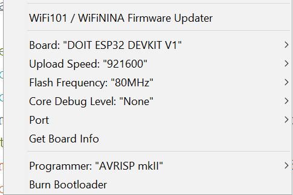

# Introduction

Heya and happy bday to you. I was thinking for a long time what I can possibly gift to you and came up with a 
soldering challenge. It had to be something where you have to notice every poor solder spot every time you look at 
it. What could be better for this purpose than a LED cube. I searched through some kits, but they were all just 
not good enough, so I designed one of my own. When you are finished there would be only two of those in the whole 
world (I assembled one as well in order to test if I did any mistakes but no. First try babyyy xD ).

The cube itself is built around an [ESP32](https://www.az-delivery.de/en/products/esp32-developmentboard) Devboard. 
Every LED cube layer has a common cathode. The anodes of an arbitrary LED are connected through all the 
layers. The percepted image is built by building one layer configuration followed by the enablement of the same with 
the common cathode. After some time the cathode is disabled and the next layer is encoded. This happens for every 
layer. The encoding of the layer is done via the [74HC595](https://www.sparkfun.com/datasheets/IC/SN74HC595.pdf) 
shift registers (IC2, IC3). Each shift register encodes a half of the layer. The curently selected layer is 
determined by enabling the common layer cathode with the [ULN2003](https://en.wikipedia.org/wiki/ULN2003A)(IC1).

Additionally, there are two buttons which use the ESP32 DevBoards builtin pullup resistors to get a logical LOW when 
pressed and a HIGH signal otherwise.

# Partslist
 - 64x LEDs blue diffuse 
 - Blank wire
 - 1x ESP32 devboard
 - 2x cutable female pin header for the esp32
 - 16x Resistors 100 Ohm
 - 2x 74HC595N
 - 1x ULN2003
 - 3x DIL-IC 16 pin sockets (optional)
 - 2x Buttons
 - 1x pin header 3 pins
 - 1x pin header connector 2 pin
 - 1x PCB
 - 4x PCB separator
 - 4x PCB separator screw flat head
 - 4x PCB separator screw cylinder head

 I put some extra parts in the package just to be sure
# Cube
This chapter is a guide how to build the actual LED cube. If you feel adventurous you can do as you like, but I 
found the described methods to work the best for me.

Pleae note there are 4 screw holes on the corners of the PCB. The print indicates which site is the parts should be 
mounted on. At the end the LED cube and the buttons shold be on top site and the other components on the bottom site 
of the PCB. ount the PCB separators on the back like shown in the image below. Please note that the flathead screws 
are used to fasten the separators to the PCB.

## Building layers
Before soldering any oter parts it is best to build the cube first. Note that there are additional holes in the pcb 
just in the right diameter to stick LEDs in them. Coincidence? However we can use those to get the spacing between 
the LEDs right. First let prepare the LEDs for the first layer.

Place a LED in one of the holes and align it to the hole verticaly from it like indicated with the green line in the 
image below. Be aware of the anode and cathode indicated by the length of the component feet. Then bend the cathode 
(which is indicated by a K because I was thinking in German when I made this image ^^;) towards the hole diagonally 
from it like shown in the following image. Repeat for 13 LEDs. I will call them LED_A from now on.

Next bend the cathodes of the other 3 LEDs like shown in the following image. Those are called LED_B.

For the first line start with the bottom line and solder all the cathodes together like shown in this image. Note 
that only LED_As are used in this step 

To start the second row use LED_B and bend the cathode leg tip like shown in the image below (red). Then connect one 
of the LED_A (purle) legs. Continue the row in the same manner like done in the first row.

Use the blank wire to connect all the rows perpendicularly like shown here.

At this point I would strongly recommend to test if all the LEDs survived the solder, by applying a low voltage ~1V 
to every LED. (Maybe with a new power supply you got recently by any chance ;) ).  

Repeat all the steps from this chapter until you have four layers.

## Connecting layers

Next step is to connect all four layers to the final cube. The main challenge here is to get the distance even 
between the layers. Remember we are building a cube not a trapeze or a parallelogram. In the image below I used a 
toilet paper roll  to separate the layers by cutting 2cm high segments out of it. Those can be removed fairly easy 
by pulling them to the side.

Finally test if all the LEDs are working properly by applying a low voltage like before.

# Board
Below is an see through image of the board. Solder all the components like ilustrated here. Note that the ICs and IC 
sockets have an orientation indicated by the cutout on their sites. The orientation of the ESP32 board is given by 
the antena (Antena should be on the outer side of the board and the usb port should be directed towards IC3). The 
buttons should be attached on the front side of the board alongside with the freshly made LED cube  

After the components are attached solder the common cathodes of the respective layers to JP21. Please note I used 
connectors on the image below because it was my first build and I wasn't sure if it's going to work. I used the pin 
headers which are also used to attach the ESP32 and cut them in single sockets for the anodes and used a line of 5 
to attach the corner anode and the four common cathodes. However, you can solder the LED cube directly to the PCB. 

That's it. If you power on the cube by attaching the micro-usb cable it should start with the first animation made 
specialy for you :D. You can switch through various animations by pressing S1 (S2 does not have any function at this 
point). 

# Flashing

I flashed the devboard before shipping so it is ready to go if you did everything right. However, if you want to 
experiment with it I attached it to this repo in the directory `src`. To flash the microcontroller I used [Arduino 
studio](https://www.arduino.cc/en/software). The board used in this project is not a part of the default 
library but can be imported by adding the board manager uri `http://arduino.esp8266.
com/stable/package_esp8266com_index.json` to the preferences. Below is the configuration I used. 

