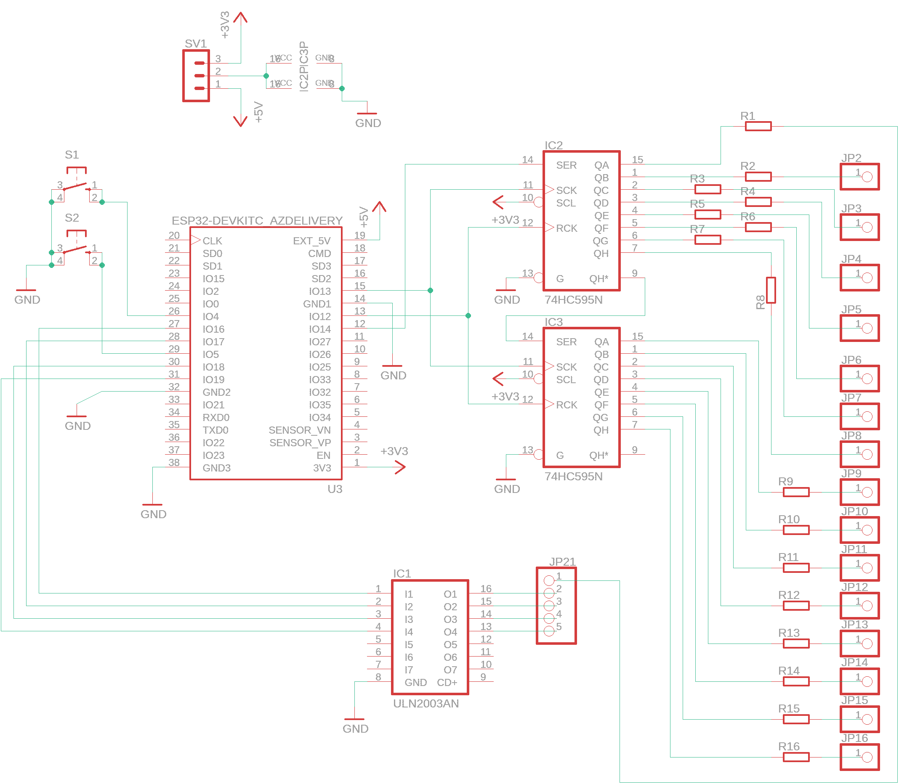
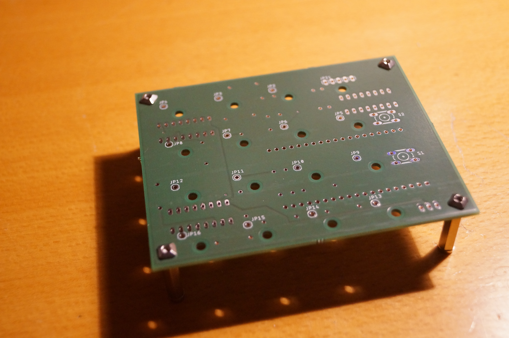
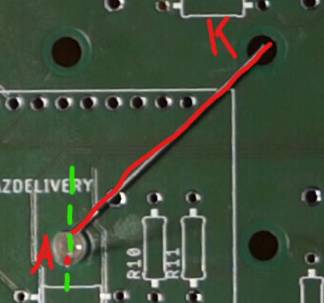
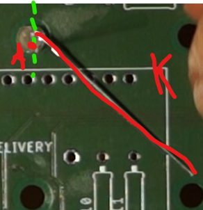
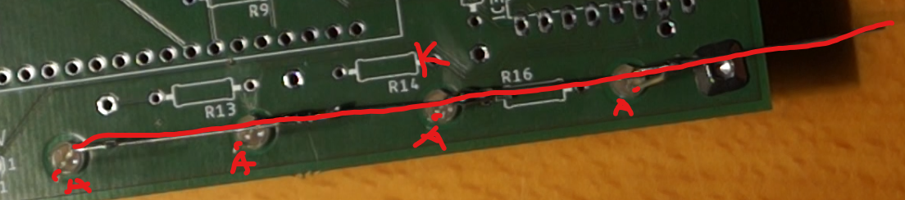
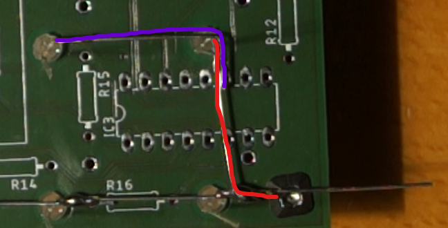
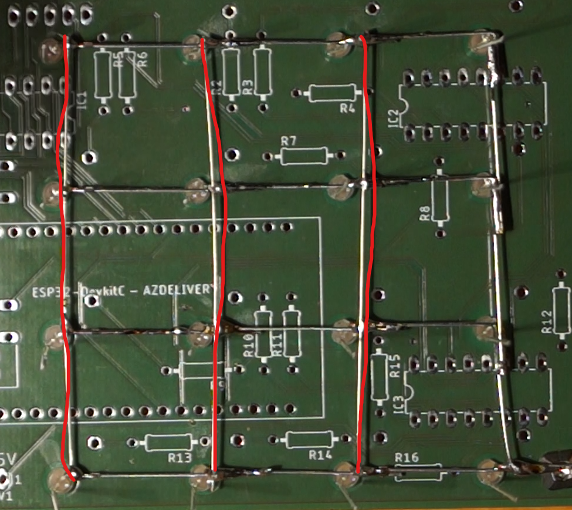
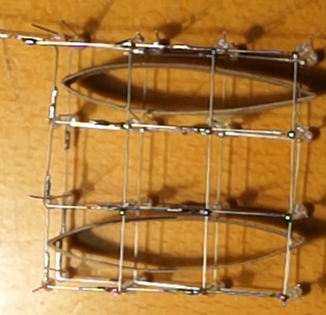
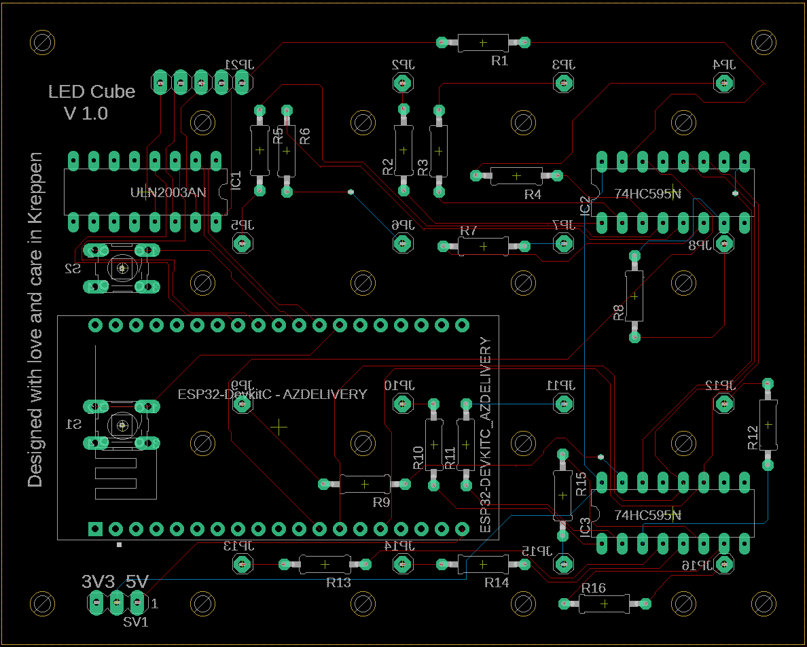
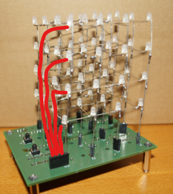

# Introduction

The cube itself is built auround an ESP32 Devboard. Every LED cube layer has a common cathode. The anodes of an 
arbitrary positional LED are connected through all the layers. The percepted image is built by building one layer 
configuration followed by the enablement of the same with the common cathode After some time the cathode is disabled 
and the next layer is encoded. This happens for every layer. The encoding of the layer is done via the 74HC595 shift 
registers (IC2, IC3). Each shift register encodes a half of the layer. The curently selected layer is determined by 
enabling the common layer cathode with the ULN2003 (IC1).

Aditionally there are two buttons which use the ESP32 DevBoards builtin pullup resistors to get a logical LOW when 
pressed and a HIGH signal otherwise.

This is just a test

# Partslist
 - 64x LEDs blue diffuse 
 - Blank wire
 - 16x Resistors 100 Ohm
 - 2x 74HC595N
 - 1x ULN2003
 - 3x DIL-IC 16 pin sockets (optional)
 - 2x Buttons
 - 1x pin header 3 pins
 - 1x pin header connector 2 pin
 - 1x PCB
 - 4x PCB separator
 - 4x PCB separator screw flat head
 - 4x PCB separator screw cylinder head
# Cube
This chapter is a guide how to build the actual LED cube. If you feel adventurous you can do as you like, but I 
found the described methods to work the best for me.

Pleae note there are 4 screw holes on the corners of the PCB. The print indicates which site is the parts should be 
mounted on. At the end the LED cube and the buttons shold be on top site and the other components on the bottom site 
of the PCB. ount the PCB separators on the back like shown in the image below. Please note that the flathead screws 
are used to fasten the separators to the PCB.

## Building layers
Before soldering any oter parts it is best to build the cube first. Note that there are additional holes in the pcb 
just in the right diameter to stick LEDs in them. Coincidence? However we can use those to get the spacing between 
the LEDs right. First let prepare the LEDs for the first layer.

Place a LED in one of the holes and align it to the hole verticaly from it like indicated with the green line in the 
image below. Be aware of the anode and cathode indicated by the length of the component feet. Then bend the cathode 
(which is indicated by a K because I was thinking in German when I made this image ^^;) towards the hole diagonally 
from it like shown in the following image. Repeat for 13 LEDs. I will call them LED_A from now on.

Next bend the cathodes of the other 3 LEDs like shown in the following image. Those are called LED_B.

For the first line start with the bottom line and solder all the cathodes together like shown in this image. Note 
that only LED_As are used in this step 

To start the second row use LED_B and bend the cathode leg tip like shown in the image below (red). Then connect one 
of the LED_A (purle) legs. Continue the row in the same manner like done in the first row.

Use the blank wire to connect all the rows perpendicularly like shown here.

At this point I would strongly recommend to test if all the LEDs survived the solder, by applying a low voltage ~1V 
to every LED. (Maybe with a new power supply you got recently by any chance ;) ).  

Repeat all the steps from this chapter until you have four layers.

## Connecting layers

# Board

# Flashing

